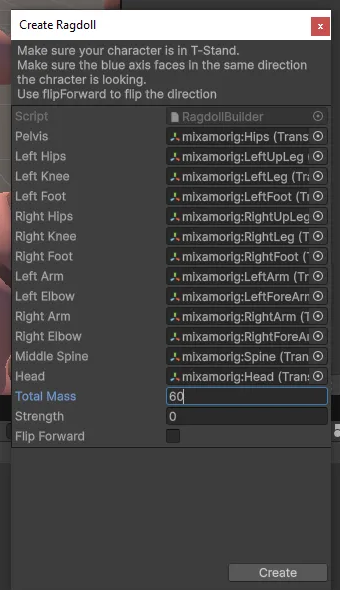

# 🧪 Лабораторная работа №3

---

## 1.7 — Разъезжающиеся ноги

> После запуска сцены заметно, что у персонажа **ноги резко расходятся в стороны**.  
> Это происходило из-за **слишком большого радиуса коллайдеров на ногах** —  
> они пересекались и вызывали физическое отталкивание.  
>
> Чтобы устранить проблему, я **уменьшил радиус** коллайдеров у всех сегментов ног  
> (`mixamorig:LeftUpLeg`, `mixamorig:LeftLeg`, `mixamorig:RightUpLeg`, `mixamorig:RightLeg`)  
> до значения **около 0.05**.  
>
> После этого модель **начала падать реалистичнее**, без резких движений и искажений.

---

## 1.10 — Конфликт анимации и физики

> Анимация выглядит **багованной**, потому что **одновременно работают и анимация, и физика**.  
> Анимация старается двигать кости персонажа, а Ragdoll тянет их в другую сторону.  
>
> Это вызывает конфликт: **кости дёргаются**, как будто персонаж ломается.  
> Чтобы избежать этого, нужно **заранее отключать Ragdoll**  
> (например, отключать компоненты `Rigidbody`) при включении анимации.

---

## 1.11 — Частичное отключение Ragdoll

> Если не все `Rigidbody` тряпичной куклы будут отключены,  
> **физика продолжит действовать** на активные части тела,  
> в то время как остальные будут **следовать анимации**.  
>
> Это приведёт к хаотичному поведению:  
> части тела **болтаются или отлетают**, создавая эффект разрушения.  
>
> Визуально это выглядит **неестественно**:  
> одни сегменты анимируются, другие — под действием физики,  
> нарушая целостность модели и вызывая дёргания.

---

## 1.12 — Выводы

> В этой лабораторной работе я разобрался, как из обычной модели сделать **тряпичную куклу (Ragdoll)**  
> и как работают компоненты **Rigidbody**, **Collider** и **Joint**.  
>
> Я научился переключать **анимацию на физику**, чтобы персонаж реалистично падал.  
> Особенно важно правильно **настраивать коллайдеры**,  
> чтобы части тела не проваливались и не отскакивали слишком резко.  
>
> Эти навыки полезны для создания **натурального поведения персонажа**,  
> особенно при **падениях и столкновениях** — в симуляторах и играх.
